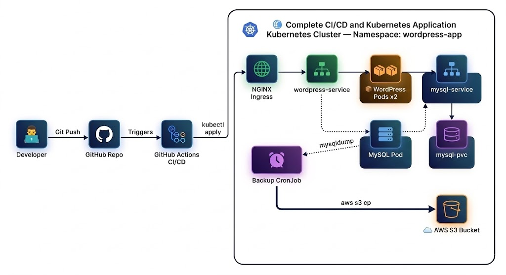

# 🚀 Project: WordPress on Kubernetes with CI/CD

> **"From Compose to Kubernetes: Deploy WordPress with Full Production Readiness"**

---

## 📋 Project Overview

In this project, you will take a real-world Docker Compose WordPress application and transform it into a fully production-ready Kubernetes deployment. You will write Kubernetes manifests from scratch, configure persistent storage, set up Ingress with a custom domain, implement an automated database backup strategy using **`mysqldump` + AWS S3**, and wire everything together with a GitHub Actions CI/CD pipeline.

**Source Reference:** Based on the [WordPress + MySQL sample](https://github.com/docker/awesome-compose/tree/master/wordpress-mysql) from Docker's `awesome-compose` repository.

---

## 🎯 Learning Objectives

| # | Skill Area | What You'll Practice |
|---|---|---|
| 1 | Docker | Reading and understanding Docker Compose multi-service applications |
| 2 | Kubernetes | Writing Deployments, Services, Secrets, ConfigMaps, PVCs, Ingress, CronJobs |
| 3 | Storage | Configuring persistent volumes so data survives pod restarts |
| 4 | Networking | Exposing applications via NGINX Ingress with a custom domain |
| 5 | Cloud Backup | Automating `mysqldump` backups uploaded to AWS S3 |
| 6 | CI/CD | Building a GitHub Actions pipeline that lints and deploys manifests |

---

## 🏗️ Architecture Diagram



---

## 🛠️ Prerequisites

Before starting, ensure you have the following:

| Tool | Purpose |
|------|---------|
| `kubectl` | Communicate with your Kubernetes cluster |
| `helm` | Install the NGINX Ingress Controller |
| `minikube` / `kind` / `k3s` | Run a local Kubernetes cluster |
| `git` | Version control |
| GitHub Account | Host repository & run Actions pipelines |
| AWS Account | S3 bucket for database backups |

---

## 📁 Required Project Structure

```
wordpress-k8s-project/
├── .github/
│   └── workflows/
│       └── deploy.yml          # CI/CD pipeline
├── k8s/
│   ├── namespace.yml
│   ├── secrets.yml
│   ├── configmap.yml
│   ├── mysql-pvc.yml
│   ├── mysql-deployment.yml
│   ├── mysql-service.yml
│   ├── wordpress-deployment.yml
│   ├── wordpress-service.yml
│   ├── ingress.yml
│   └── backup/
│       └── backup-cronjob.yml  # S3 backup job
├── docker-compose.yml          # Provided for reference
├── README.md
└── .gitignore
```
